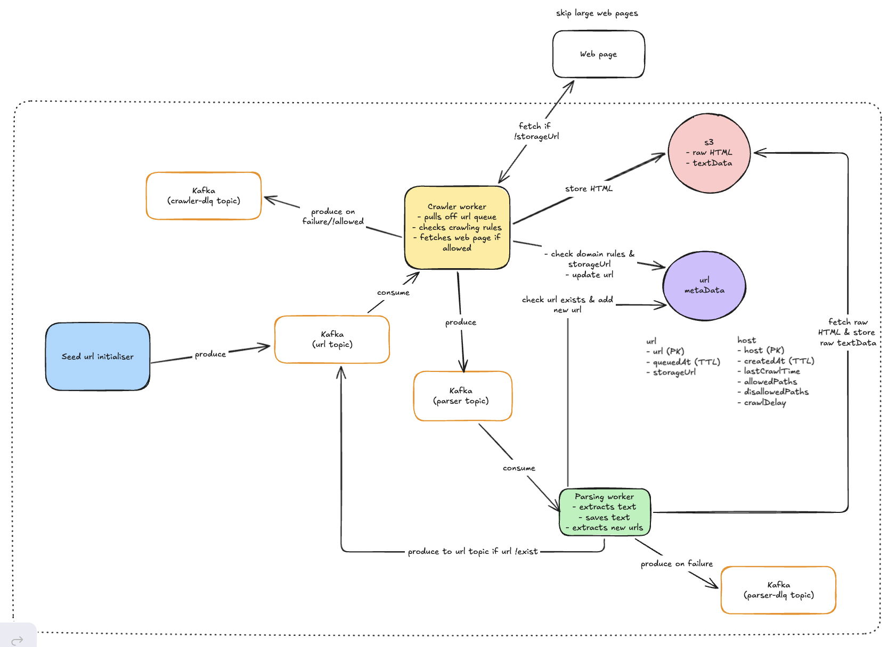

## Distributed Web Crawler

A distributed web crawler built with 3 Go microservices communicating via Kafka, storing crawled raw HTML and parsed text in AWS S3, and URL metadata in MongoDB.

### Stack

- Go
- Apache Kafka
- AWS S3 (via Terraform)
- Docker
- MongoDB

### Architecture



### Repo Structure

This repository uses a multi-module structure with a Go workspace.

`/shared/go.mod` - reusable library code (e.g. config, common libraries, etc.)

`/services/initialiser/go.mod`

`/services/crawler/go.mod`

`/services/parser/go.mod`

`go.work` - workspace definition (links modules together locally)

Each module manages its own dependencies independently.

Run `go work sync` after running `go get` or modifying `go.mod` in a workspace module.

See `/.claude/CLAUDE.md` for more details on the repo structure.

### Development

#### Prerequisites

Crawler & parser services require AWS SSO authentication. 
Just follow the login steps on the browser window that automatically opens when running the app.

#### Run full stack with Docker

Start:
```bash
make up
```

Stop: 
```bash
make down
```

Stop and delete all volumes:
```bash
make down/volumes
```

#### Run services individually without Docker

Kafka is always running via Docker and must be running first:
```bash
cd infra/kafka && make up
# Kafka UI: http://localhost:8080
```

MongoDB is always running via Docker:

```bash
cd infra/db && make up
```

Then from `services/initialiser` | `services/crawler` | `services/parser`:
```bash
make run
```

#### Lint

From `services/initialiser` | `services/crawler` | `services/parser` | `shared/` run:
```bash
make lint        # install + run
make lint/fix    # auto-fix
```

#### Build (Linux x86_64 binary)
From `services/initialiser` | `services/crawler` | `services/parser` | `shared/` run:
```bash
make build
```

### Infrastructure

Terraform config is in `infra/terraform`. Requires `aws sso login --profile terraform` before applying.

### CI/CD

GitHub Actions workflows run on PRs to `master` (build + lint) and pushes to `master` (release to Docker Hub).
